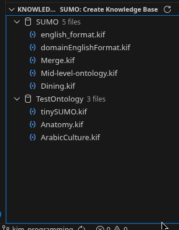
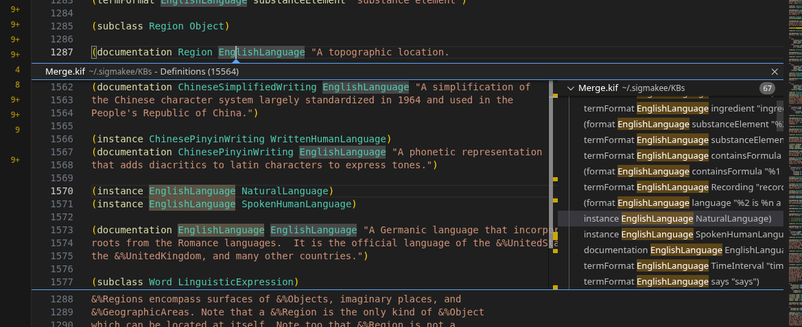
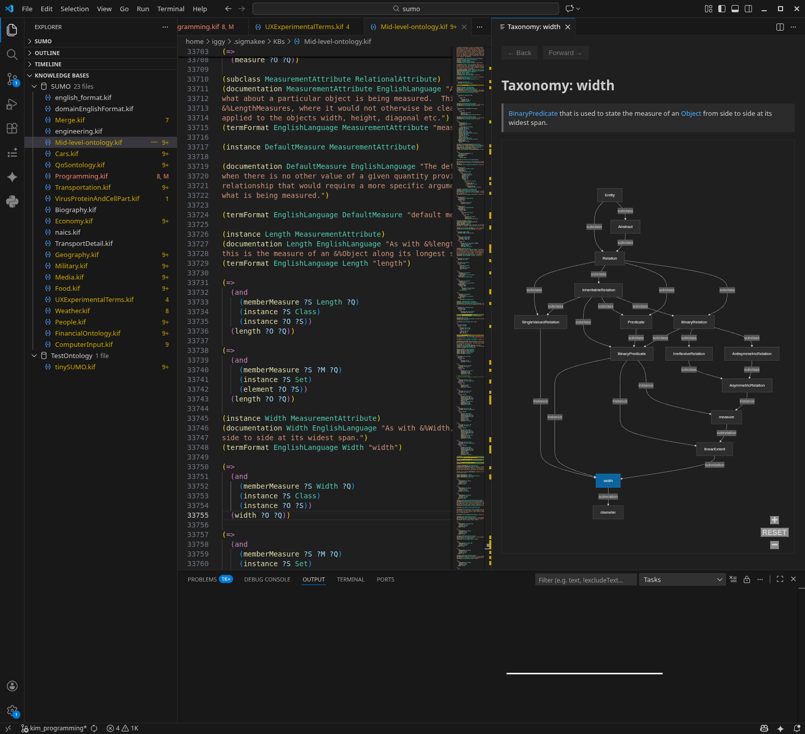
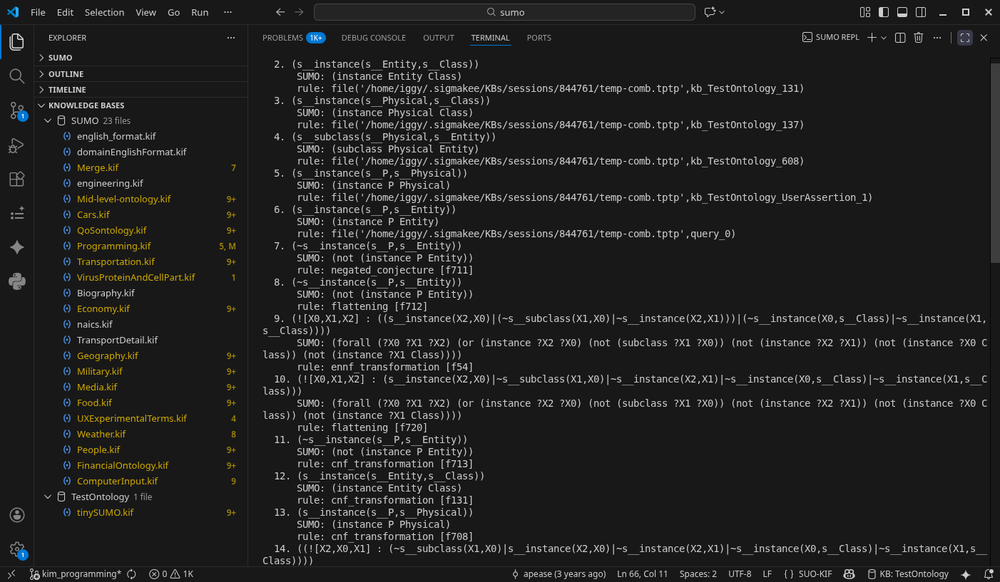

# SUMO: Suggested Upper Merged Ontology for VSCode

A comprehensive development environment for **SUMO (SUO-KIF)** and **TPTP** in Visual Studio Code. This extension provides advanced language intelligence, Knowledge Base (KB) management, interactive taxonomy browsing, and seamless theorem prover integration.

## Core Features

### Knowledge Base Explorer
Manage your Sigma Knowledge Bases directly from the sidebar.
- **Open KB**: Automatically detect and load KBs from your Sigma `config.xml`.
- **Add/Remove Files**: Easily manage constituent `.kif` files.
- **Create KB**: Scaffold new knowledge bases with a simple guided process.
- **Context Awareness**: The extension tracks which KB you are currently working in, enabling KB-specific search and navigation.



### SUMO Language Support
Rich support for the **SUO-KIF** and **TPTP** languages used by SUMO:
- **Go to Definition (F12)**: Jump to where a term is defined via `instance`, `subclass`, `domain`, etc.
- **Hover & Autocomplete**: View documentation and argument types (from `domain` declarations) as you type.
- **Signature Help**: Real-time guidance on relation arguments while writing axioms.
- **Diagnostics**: Instant feedback on syntax errors, naming conventions, and arity mismatches.



### Interactive Taxonomy
Visualize the ontology structure with a dedicated webview:
- **Ancestor & Descendant Trees**: Explore the hierarchy of any class or relation.
- **Inline Documentation**: Read the `documentation` strings for terms as you browse.
- **Interactive Navigation**: Right-click nodes to focus on a new term or search for its occurrences in the workspace.



### Sigma Runtime Modes
Flexibility in how you run Sigma translation logic:
- **Local**: Uses your local SigmaKEE installation (requires Java).
- **Docker**: Connects to a running SigmaKEE docker container. **NOTE: This does not work currently**
- **Native JS (Experimental)**: A built-in JavaScript implementation for TPTP conversion—no external dependencies required. **NOTE: This is purely experimental! Use at your own risk and check all results against actual output from Sigma*

### Theorem Prover Integration
Verify your axioms with theorem provers like **Vampire** and **E-Prover**:
- **Query Prover**: Select an axiom and run it as a conjecture against your workspace.
- **Scope-based Verification**: Run the prover on a selection, the current file, or the entire workspace.
- **TPTP Generation**: Export your SUMO KBs to TPTP (`fof`, `tff`, or `thf` formats).



## Commands & Keybindings

| Command | Keybinding | Context |
|---------|------------|---------|
| `SUMO: Open Knowledge Base` | | Command Palette |
| `SUMO: Search Symbol in Workspace` | | Editor Context / Palette |
| `SUMO: Go to Definition` | `F12` | Editor Context |
| `SUMO: Format Axiom` | `Ctrl+Shift+F` | Editor Context (Selection) |
| `SUMO: Show Class Taxonomy` | | Editor Context / Palette |
| `SUMO: Browse Term in Sigma` | `Ctrl+Shift+B` | Editor Context |
| `SUMO: Query with Theorem Prover` | | Editor Context (Selection) |
| `SUMO: Check for Errors` | | Editor Context / Palette |
| `SUMO: Generate TPTP File` | | Command Palette |

## Configuration

Access these settings via `File` > `Preferences` > `Settings` (search for "SUMO"):

### General
- `sumo.general.language`: Language for documentation (default: `EnglishLanguage`).
- `sumo.general.formatIndentSize`: Number of spaces for indentation (default: `2`).

### Sigma
- `sumo.sigma.runtime`: Choose between `local`, `docker`, or `native`.
- `sumo.sigma.configXmlPath`: Explicit path to Sigma's `config.xml`.
- `sumo.sigma.url`: The URL for the online Sigma browser.

### Theorem Prover
- `sumo.theoremProver.path`: Path to your prover executable (Vampire/E).
- `sumo.theoremProver.type`: Prover type (`vampire` or `eprover`).
- `sumo.theoremProver.timeout`: Seconds before the prover gives up (default: `30`).
- `sumo.theoremProver.tptpLang`: TPTP format (`fof`, `tff`, or `thf`).

## Requirements

- **VSCode** 1.70.0+
- (Optional) **Java** for Local Sigma runtime.
- (Optional) **Docker** for Docker Sigma runtime.
- (Optional) **Vampire** or **E-Prover** for theorem proving features.

## Resources
- [Ontology Portal (SUMO)](https://www.ontologyportal.org/)
- [SigmaKEE GitHub](https://github.com/ontologyportal/sigmakee)
- [TPTP Problem Library](https://www.tptp.org/)

---
**License**: MIT
**Credits**: Developed by the Ontology Portal community.

```
Niles, I., and Pease, A.  2001.  Towards a Standard Upper Ontology.  In 
Proceedings of the 2nd International Conference on Formal Ontology in 
Information Systems (FOIS-2001), Chris Welty and Barry Smith, eds, 
Ogunquit, Maine, October 17-19, 2001.  Also see http://www.ontologyportal.org
```

```
G. Sutcliffe, “Stepping Stones in the TPTP World,” in Proc. 12th Int. Joint Conf. Automated Reasoning, vol. 14739, C. Benzmüller, M. Heule, and R. Schmidt, Eds. Nancy, France: Lecture Notes in Artificial Intelligence, 2024, pp. 30–50.
```
