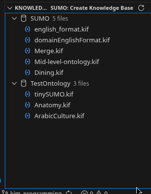
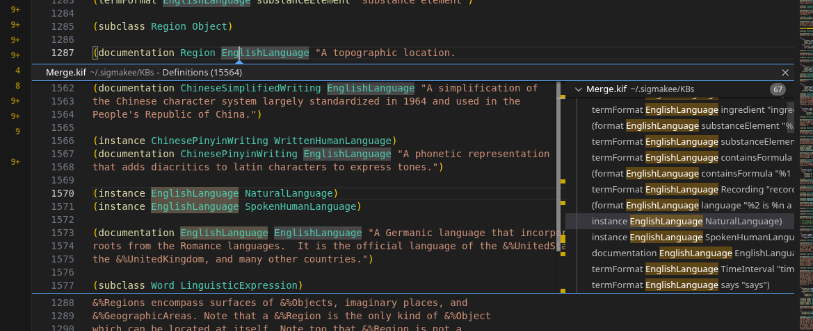
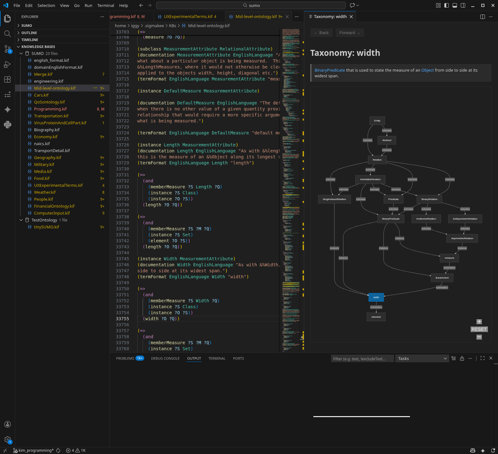
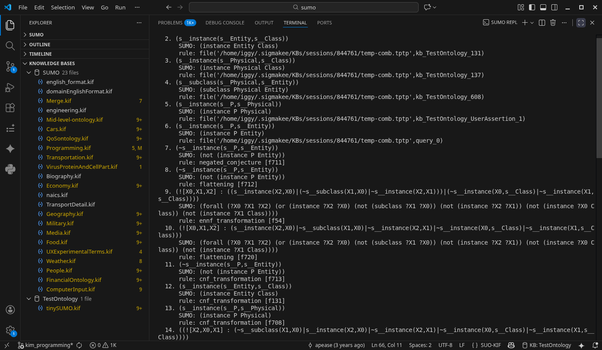

# SUMO for VSCode

A VSCode development environment for **SUMO (SUO-KIF)** and **TPTP**
knowledge bases, backed by the [`sumo-lsp`](https://github.com/ontologyportal)
language server and the `sumo serve` kernel.

Language intelligence — hover, go-to-definition, references, rename,
document and workspace symbols, semantic tokens, formatting,
completion, and diagnostics — is supplied by `sumo-lsp`.  The
extension also ships:

- Bundled SUO-KIF and TPTP grammars + language configuration.
- An Explorer tree view listing Sigma knowledge bases declared in
  `config.xml` plus their constituent files.
- The Ask / Tell / Generate-TPTP commands backed by the `sumo` kernel.
- A taxonomy webview with Mermaid rendering and pan-zoom for
  exploring ancestor / descendant trees of any class or relation.
- An interactive Ask / Tell REPL as a VSCode pseudoterminal.

## Core features

### Knowledge Base Explorer

- **Load KB** (`SUMO: Load Knowledge Base…`): pick a KB declared in
  your Sigma `config.xml`.
- **Open in New Window**: isolate each KB in its own VSCode window;
  symbol namespaces never cross-contaminate because each window runs
  its own `sumo-lsp` subprocess.
- **Create KB** (`SUMO: Create Knowledge Base…`): scaffold a new
  `<kb name="…">` entry in `config.xml` with an optional seed file.
- **Add / Remove Files**: tree-view actions write the change back to
  `config.xml` (for config KBs) or to the in-window state (for
  temporary KBs).
- **Status bar**: the active KB and its file count are always
  visible at the lower-left.



### Language intelligence (via `sumo-lsp`)

- Go to Definition (`F12`) via `instance`, `subclass`, `domain`, etc.
- Hover documentation with `domain`/`range` argument types.
- Signature help while writing axioms.
- Diagnostics for syntax, arity mismatches, naming conventions, and
  other semantic errors.  Suppress codes selectively with
  `sumo.diagnostics.ignoredCodes`.



### Interactive taxonomy

Right-click a symbol → **SUMO: Show Taxonomy** to open a webview of
the ancestor / descendant graph.  Navigate interactively, jump
between terms, and read `documentation` strings inline.



### Theorem proving

Ask conjectures against the live KB with **SUMO: Ask (form under
cursor)** or run a multi-turn **SUMO: Open Interactive REPL**.  The
kernel (`sumo serve`) caches the KB in an LMDB between runs, so
repeat asks amortise the load cost.

- `SUMO: Ask (form under cursor)` — one-shot ask with a proof / status
  webview.
- `SUMO: Open Interactive REPL (Ask/Tell)` — persistent session in a
  pseudoterminal.  Prefix with `tell` to assert, `ask` (or a bare
  KIF form) to query.  `:help` and `:quit` are meta-commands.
- `SUMO: Restart Kernel`, `SUMO: Rebuild Kernel Database`, and
  `SUMO: Delete Kernel Database` for lifecycle management.



### TPTP export

**SUMO: Generate TPTP File** compiles the loaded KB to TPTP via the
kernel's `kb.generateTptp` RPC.  The kernel uses the same converter
as `sumo ask`, so the output matches exactly what the prover sees
internally.  Dialect selectable via `sumo.tptp.lang` (`fof` or `tff`).

### Browse in Sigma

**SUMO: Browse Term in Sigma** (`Ctrl/Cmd+Shift+B`) opens the online
Sigma browser at the symbol under the cursor, using the URL from
`sumo.sigma.url`.

### Format axiom

**SUMO: Format Axiom** (`Ctrl/Cmd+Shift+F`) reformats the enclosing
S-expression using `sumo-lsp`'s document-range formatter.

## Commands & keybindings

| Command                                          | Keybinding                    | Context                                         |
|--------------------------------------------------|--------------------------------|-------------------------------------------------|
| `SUMO: Load Knowledge Base…`                     | —                              | Command Palette                                 |
| `SUMO: Open Knowledge Base in New Window…`       | —                              | Command Palette / tree title                    |
| `SUMO: Create Knowledge Base…`                   | —                              | Command Palette / tree title                    |
| `SUMO: Add File to Knowledge Base…`              | —                              | Tree item context                               |
| `SUMO: Remove File from Knowledge Base`          | —                              | Tree item context                               |
| `SUMO: Close Knowledge Base`                     | —                              | Tree item context                               |
| `SUMO: Reload config.xml`                        | —                              | Tree title                                      |
| `SUMO: Show Taxonomy`                            | —                              | Editor context (`.kif`)                         |
| `SUMO: Ask (form under cursor)`                  | —                              | Editor context (`.kif`)                         |
| `SUMO: Open Interactive REPL (Ask/Tell)`         | —                              | Editor context (`.kif`) / Palette               |
| `SUMO: Browse Term in Sigma`                     | `Ctrl/Cmd+Shift+B`             | Editor context (`.kif`)                         |
| `SUMO: Format Axiom`                             | `Ctrl/Cmd+Shift+F`             | Editor context (`.kif`) with selection          |
| `SUMO: Generate TPTP File`                       | —                              | Editor context (`.kif`) / Palette               |
| `SUMO: Restart Language Server`                  | —                              | Palette                                         |
| `SUMO: Restart Kernel`                           | —                              | Palette                                         |
| `SUMO: Rebuild Kernel Database`                  | —                              | Palette                                         |
| `SUMO: Delete Kernel Database`                   | —                              | Palette                                         |
| `SUMO: Reconcile Open Files`                     | —                              | Palette                                         |
| `SUMO: Show Kernel File Status`                  | —                              | Palette                                         |
| `SUMO: Show KB Status` / `Show Server Output`    | —                              | Palette / status bar                            |

## Configuration

Access via `File` → `Preferences` → `Settings` and search for **SUMO**.

### Server (`sumo-lsp`)

- `sumo.server.path` — override the `sumo-lsp` binary.
- `sumo.server.args`, `sumo.server.env` — extra CLI args / env vars.
- `sumo.trace.server` — `off` / `messages` / `verbose`.

### Kernel (`sumo serve`)

- `sumo.kernel.path` — override the `sumo` binary.
- `sumo.kernel.dbPath` — override the LMDB directory.
- `sumo.kernel.disableCache` — run entirely in memory, no LMDB.
- `sumo.kernel.vampirePath` — override the Vampire binary path.
- `sumo.prover.timeoutSecs` — max seconds per `ask` (default 30).

### Knowledge base

- `sumo.configPath` — path to `config.xml` (file or directory).
  Falls back to `$SIGMA_HOME/KBs/config.xml`, then
  `~/.sigmakee/KBs/config.xml`.
- `sumo.activeKb` (window-scoped) — pin a window to a named KB.
- `sumo.documentation.language` — language tag for taxonomy docs
  (default `EnglishLanguage`).

### TPTP + Sigma browser

- `sumo.tptp.lang` — `fof` or `tff`.
- `sumo.sigma.url` — base URL for **Browse Term in Sigma**.

### Diagnostics

- `sumo.diagnostics.ignoredCodes` — kebab-case semantic-error codes
  to suppress (e.g. `arity-mismatch`, `predicate-case`).

## Server-binary resolution

At activation the extension looks for `sumo-lsp` and `sumo` in the
following order, logging its choice to the **SUMO** output channel:

1. `sumo.server.path` / `sumo.kernel.path` setting (any scope, any
   absolute or relative path).
2. `<extensionPath>/server/{sumo-lsp, sumo}(.exe)` — bundled binary,
   present in the platform-specific VSIX.
3. `sumo-lsp` / `sumo` on `$PATH` — fallback when neither of the
   above resolves.

Published VSIXs are **platform-specific** (`darwin-arm64`,
`darwin-x64`, `linux-x64`, `linux-arm64`, `win32-x64`) and ship the
matching native binaries so end users don't need a separate install.

## Packaging from source

Build a single-platform VSIX for local testing:

```bash
cd ~/projects/sigma-rs
cargo build --release -p sumo-lsp -p sumo-native

cd ~/projects/vscode  # this repo
./scripts/package-platform.sh aarch64-apple-darwin \
    ~/projects/sigma-rs/target/release/sumo-lsp \
    ~/projects/sigma-rs/target/release/sumo
code --install-extension sumo-*.vsix
```

The `scripts/package-platform.sh` helper accepts any of:
`aarch64-apple-darwin`, `x86_64-apple-darwin`,
`x86_64-unknown-linux-gnu`, `aarch64-unknown-linux-gnu`,
`x86_64-pc-windows-msvc`.

CI / tag-triggered multi-platform builds live in
`.github/workflows/release.yml`.

## Requirements

- VSCode 1.85.0+.
- Optional: **Vampire** for theorem proving (see
  `sumo.kernel.vampirePath`).  Everything except `ask` / REPL /
  generate-TPTP works without it.

## Resources

- [Ontology Portal (SUMO)](https://www.ontologyportal.org/)
- [SigmaKEE on GitHub](https://github.com/ontologyportal/sigmakee)
- [TPTP Problem Library](https://www.tptp.org/)

---

**License**: MIT
**Credits**: Developed by the Ontology Portal community.

```
Niles, I., and Pease, A.  2001.  Towards a Standard Upper Ontology.  In
Proceedings of the 2nd International Conference on Formal Ontology in
Information Systems (FOIS-2001), Chris Welty and Barry Smith, eds,
Ogunquit, Maine, October 17-19, 2001.  Also see http://www.ontologyportal.org
```
